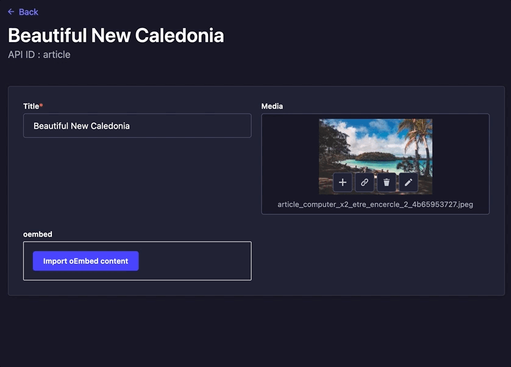

# Strapi plugin oEmbed-extended

Embed content from third party sites for https://strapi.io v4. This plugin is based on [nicolashmln/strapi-plugin-oembed](https://github.com/nicolashmln/strapi-plugin-oembed). It adds all possible embedable sources via the [extractus/oembed-extractor](https://github.com/extractus/oembed-extractor) library.



## How it works

- Add the field in your model
- When you create a new content, paste the URL of the third party site in the modal
- The data is fetched and stored in the content

## Installation

Using npm

```bash
npm install --save @7azin/strapi-plugin-oembed
npm run build
```

Using yarn

```bash
yarn add @7azin/strapi-plugin-oembed
yarn build
```

## Setup

Go to your model and add the `oembed` field. For example if you have a content type `Article` it will be in `/api/article/models/article.settings.json` and paste the field in the `attributes` section.

e.g

```json
{
  "kind": "collectionType",
  "collectionName": "articles",
  ...
  "attributes": {
    ...
    "oembed": {
      "type": "customField",
      "customField": "plugin::oembed.oembed"
    }
    ...
  }
}
```

Now you'll have the oembed field when you create a new article.

## Example of the data fetched

If you paste the url `https://www.youtube.com/watch?v=tkiOqSTVGds` in the modal, this data will be stored:

```json
{
  "title":"Familien gehören zusammen! - Dokumentation",
  "author_name":"Seebrücke",
  "author_url":"https://www.youtube.com/@Seebruecke",
  "type":"video",
  "height":113,
  "width":200,
  "version":"1.0",
  "provider_name":"YouTube",
  "provider_url":"https://www.youtube.com/",
  "thumbnail_height":360,
  "thumbnail_width":480,
  "thumbnail_url":"https://i.ytimg.com/vi/fn-KS8vDJuI/maxresdefault.jpg",
  "html":"<iframe ... ></iframe>",
  "fetched_thumbnail":"data:image/jpg;base64, BASE64 IMAGE DATA",
  "url":"https://www.youtube.com/watch?v=fn-KS8vDJuI"
}
```

for Instagram you would get 
```json
{
  "url":"https://www.instagram.com/p/CtosQTNsUXt/",
  "provider_name":"Instagram"
}
```

As long as you don't have a special token from Instagram, they don't provide 
any OEmbed service. We provide still the URL and you can use it together
with a front end embed platform to show the Instagram Embed.

for Twitter you would get
```json
{
   "url":"https://twitter.com/_Seebruecke_/status/1599102388710670336",
   "author_name":"Seebrücke",
   "author_url":"https://twitter.com/_Seebruecke_",
   "html":"<blockquote ...",
   "width":550,
   "height":null,
   "type":"rich",
   "cache_age":"3153600000",
   "provider_name":"Twitter",
   "provider_url":"https://twitter.com",
   "version":"1.0"
}
```

**Note:** the data returned from your endpoint will be a string and not a JSON object. You'll just have to parse the data in your front (`JSON.parse(article.oembed)`).

## Supported third party sites

All 700 services supported by official OEmbed are supported.